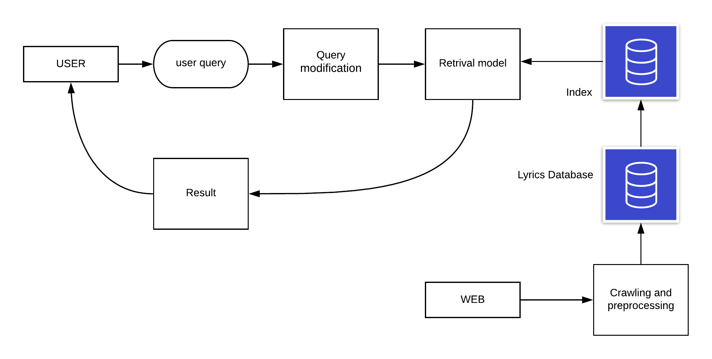

# Sinhla song search engnine

The search engine was created using Elasticsearch. The search engine only consists of Sinhala songs. A simple UI and a backend were created using Python Flask.



#  Sinhala Lyrics Corpus

This corpus was built using scraping data from https://sinhalasongbook.com/ site. The corpus has 718 songs. There were 8 metadata were selected in addition to the lyrics.

### Attributes

**name** - name of the song

**artist** - name of the singers

**genre** - genres of the song

**lyrics by** - lyrics writer of the song

**music by** - music directors of the song

**key** - key of the song

**views** - how many people have viewed the song

**shares** - how many people have shared the song  

**lyrics** - song's lyrics

# Implementation 
### setting up python 
1. install python version 3.7
2. install required packages executing ```$ pip install -r requirements.txt``` this command inside in the project root directory
3. Download and setup [SinLing](https://github.com/ysenarath/sinling). You may want to configure the [python path](https://www.devdungeon.com/content/python-import-syspath-and-pythonpath-tutorial) to import the python moduls 

### Setting up Elasticsearch
1. Download [Elasticsearch](https://www.elastic.co/downloads/elasticsearch)
> The project was built using Elasticsearch 6.8 version because the latest version of Elasticsearch was not compatible with java 8
2. Intall [Kibana](https://www.elastic.co/downloads/kibana) to do the query operation on elasticsearch. 
3. Install [ICU Analysis](https://www.elastic.co/guide/en/elasticsearch/plugins/current/analysis-icu.html) plugin
> Always try to install the same version in above 1,2,3

### setting up index

1. First of it necessary to create an index to perform operations. To do that execute below queries on Elasticsearch 
```
PUT lyrics
 {
    "settings": {
      "index" : {
            "number_of_shards" : 1, 
            "number_of_replicas" : 1 
      },
      "analysis": {
         "char_filter": {
           "unwanterd_characters":{
              "type": "mapping",
              "mappings": [ 
                "\u200d=>", 
                "\u200B=>",
                ",=> ",
                ".=> ",
                "/=> ",
                "|=> ",
                "-=> ",
                "'=> ",
                "_=> "
          ]
           }
          },
          "filter": {
            "edge_ngram_filter": {
              "type": "edge_ngram",
              "min_gram": 2,
              "max_gram": 20
            },
            "stop_word_filter":{
              "type": "stop",
              "stopwords":["සහ","හා", "වැනි", "සේ", "‌මෙන්", "සමග"]
            }
          },
          "analyzer": {
            "data_analyzer": { 
              "type": "custom",
              "tokenizer": "icu_tokenizer",
              "char_filter":"unwanterd_characters",
              "filter": [
                "lowercase",
                "stop_word_filter",
                "edge_ngram_filter"
              ]
            },
            "search_analyzer":{
              "type":"custom",
              "tokenizer": "icu_tokenizer",
              "char_filter":"unwanterd_characters",
              "filter": [
                "lowercase",
                "stop_word_filter"
              ]
            }
          }
        }
    },
    "mappings": {
    "doc":{
        "dynamic":"strict",
        "properties": {
          
            "name": {
                "type": "text",
                "analyzer": "data_analyzer",
                "search_analyzer":"search_analyzer"
            },
            "artist": {
                "type": "text",
                "analyzer": "data_analyzer",
                "search_analyzer":"search_analyzer"
            },
            "genere": {
                "type": "text",
                "analyzer": "data_analyzer",
                "search_analyzer":"search_analyzer"
            },
            "lyrics by": {
                "type": "text",
                "analyzer": "data_analyzer",
                "search_analyzer":"search_analyzer"
            },
            "music by": {
                "type": "text",
                "analyzer": "data_analyzer",
                "search_analyzer":"search_analyzer"
            },
            "key": {
                "type": "text",
                "analyzer": "data_analyzer",
                "search_analyzer":"search_analyzer"
            },
            "views": {
                "type": "integer"
            },
            "shares": {
                "type": "integer"
            },
            "lyrics": {
                "type": "text",
                "analyzer": "data_analyzer",
                "search_analyzer":"search_analyzer"
            }
        }
    }
    }
}
```
2. run the [es.py](https://github.com/DulanjayaChathura/IR-project/blob/master/elasticsearch/es.py) to upload all the objects to created index
> This es.py file is helped to upload all the objects to created indexes using the [bulk helpers](https://elasticsearch-py.readthedocs.io/en/master/helpers.html)


# Running the project

1. Run ElasticSearch [locally](https://www.elastic.co/guide/en/elasticsearch/reference/6.8/getting-started-install.html).
2. Run Kibana [locally]((https://www.elastic.co/guide/en/kibana/6.8/windows.html) )
> Before running the Kibana, you should run the ElasticSearch 
3. Run [app.py](https://github.com/DulanjayaChathura/IR-project/tree/master/UI) 
> Now you can see the flask server run on port 5000 in your local machine

# Usage
- The search engine supports advanced queries. You can search for lyrics based on the song's name, lyrics by, music by, genre, key. Also, you can search for lyrics by the popularity of the song too. 
- seaerch by song name (සොයා පිළිසරණක්)

  

- seach by artist (වික්ටර් රත්නායකගේ ගීත ) 

  

- search by music producer by (ක්ලැරන්ස් විජේවර්ධන අධ්‍යක්ෂණය  කළ ගීත)

  

- search by lyrics writter by (කුමාරදාස සපුතන්ත්‍රි රචිත ගීත)

  

- search by key of the song (f minor)

  

- search lyrics by the popularity of the song (අමරදේවගේ හොඳම ගීත)

  


